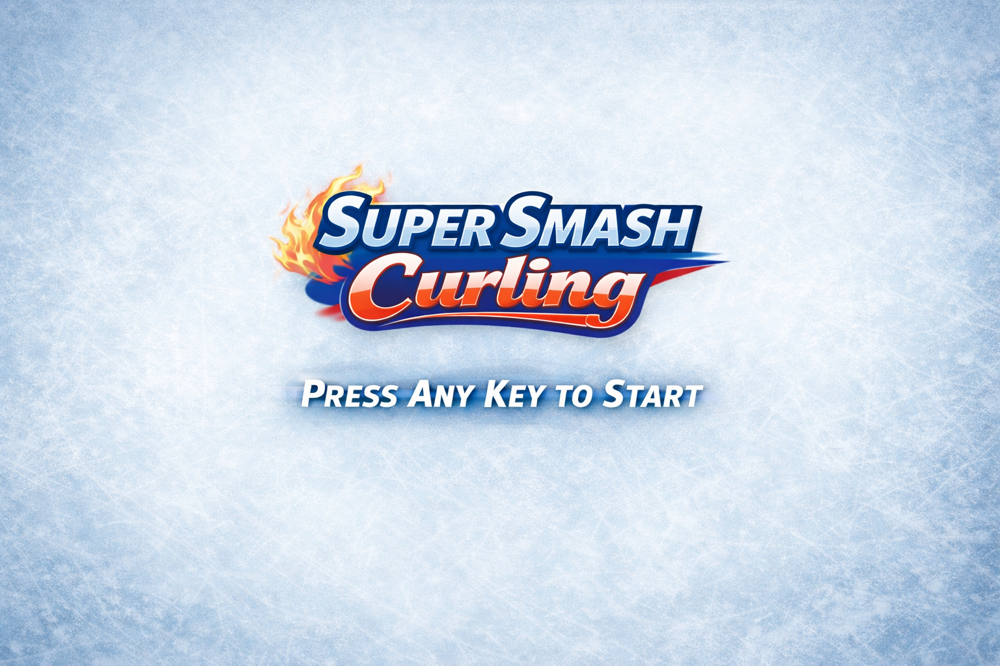

# Super Smash Curling (HTML5 + Matter.js) 

A playable browser-based curling proof of concept inspired by Winter Olympic curling.

Version: `0.0.1`

This project uses:
- HTML/CSS for HUD and presentation
- Canvas rendering with Matter.js physics
- Lightweight audio synthesis for stone slide/collision/sweep feedback

## Features

- Birds-eye curling sheet with scrolling camera
- Two teams: `GB` (red) vs `USA` (yellow)
- Match flow: **3 ends**, **6 stones per team per end**
- Mouse + arrow-key aiming
- Space-bar hold/release power system with visual meter
- Space-bar tap sweeping (subtle effect, proximity-blocked near other stones)
- End scoring based on curling-style closest-stone logic
- End-of-end scoring stones flash before continue
- Winner overlay at match end

## Controls

- `Mouse` or `← / →`: Aim before release
- `Space (hold)`: Build power
- `Space (release)`: Throw stone
- `Space (tap repeatedly after release)`: Sweep
- `Any key` at end-of-end/game-over: Continue / restart flow

## Scoring Rules Implemented

- Only stones touching/breaking the outer blue house ring are eligible.
- The team with the closest eligible stone scores.
- That team scores one point for each of its stones closer than the opponent’s nearest eligible stone.

## Run Locally

> Recommended: run from a local web server (not `file://`) for best browser behavior.

From repo root:

```bash
python3 -m http.server 8080
```

Then open:

`http://localhost:8080`

## Tests

Gameplay mechanics tests:

```bash
node tests/gameplay-mechanics.test.js
```

Syntax check:

```bash
node --check game.js
```

## Project Structure

```text
.
├── index.html                  # HUD layout + script/style includes
├── styles.css                  # UI, HUD, title screen styling
├── game.js                     # Main game logic, render, audio, physics
├── images/
│   ├── title-screen.png
│   ├── score-header.png
│   ├── winner.png
│   ├── red-stone.png
│   ├── yellow-stone.png
│   ├── broom-right.png
│   ├── union-flag.png
│   ├── star-spangled-banner.png
│   └── ice.png
├── tests/
│   └── gameplay-mechanics.test.js
└── docs/
    ├── preview.png.txt
    └── preview.gif.txt
```

## Preview

Add media files to the repo (or GitHub assets) and reference them here.

Example:

```md



```

If you do not want a `docs/` folder, you can also paste GitHub-hosted asset URLs after upload.

## Roadmap

- Improve stone-vs-stone collision feel with more tuning presets.
- Add optional scoreboard animation polish and end transition effects.
- Add configurable match setup (ends/stones) via UI.
- Add sound on/off and volume sliders in HUD.
- Expand tests to cover turn-order and end-transition edge cases.
- Add mobile/tablet control profile.

## Notes

- Matter.js is loaded from CDN in `index.html`.
- If a browser blocks CDN scripts, allow network access for the page and reload.
- This is a POC focused on playability and feel rather than full competition-rule coverage.

## GitHub Pages

This repo includes a GitHub Actions Pages workflow at `.github/workflows/pages.yml`.

After pushing to GitHub:
1. Open repository `Settings` -> `Pages`.
2. Set `Source` to `GitHub Actions`.
3. Push to `master` or `main`.

Your game will be available at:

`https://newell.paul.github.io/super-smash-curling/`
